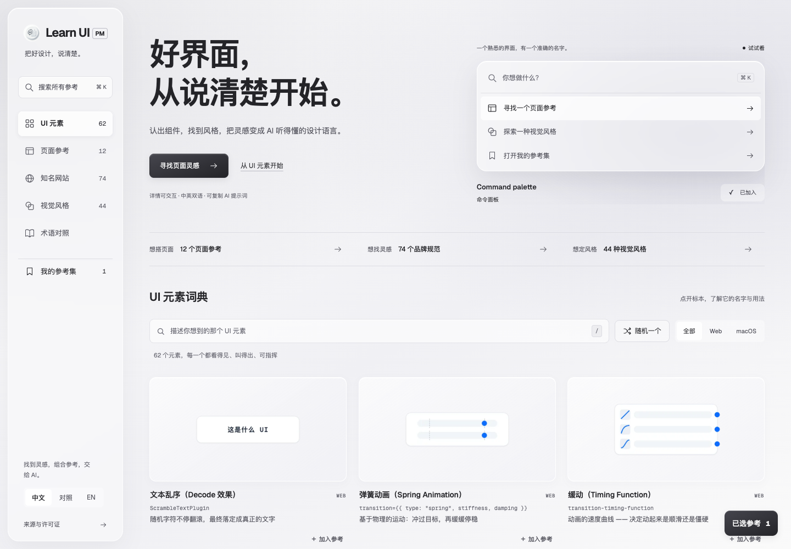
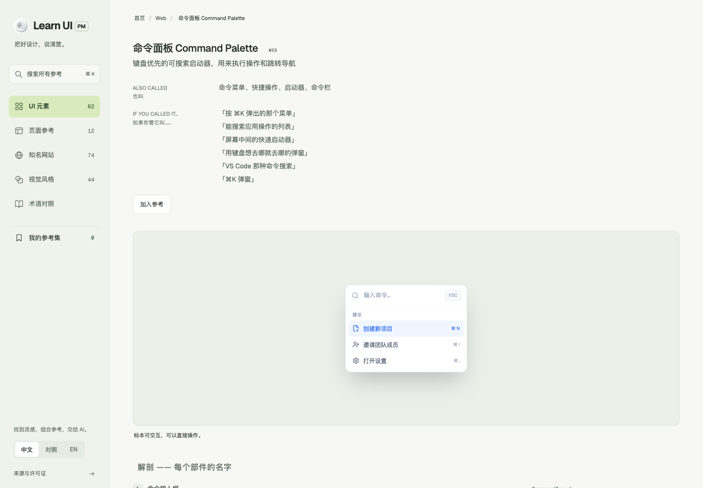
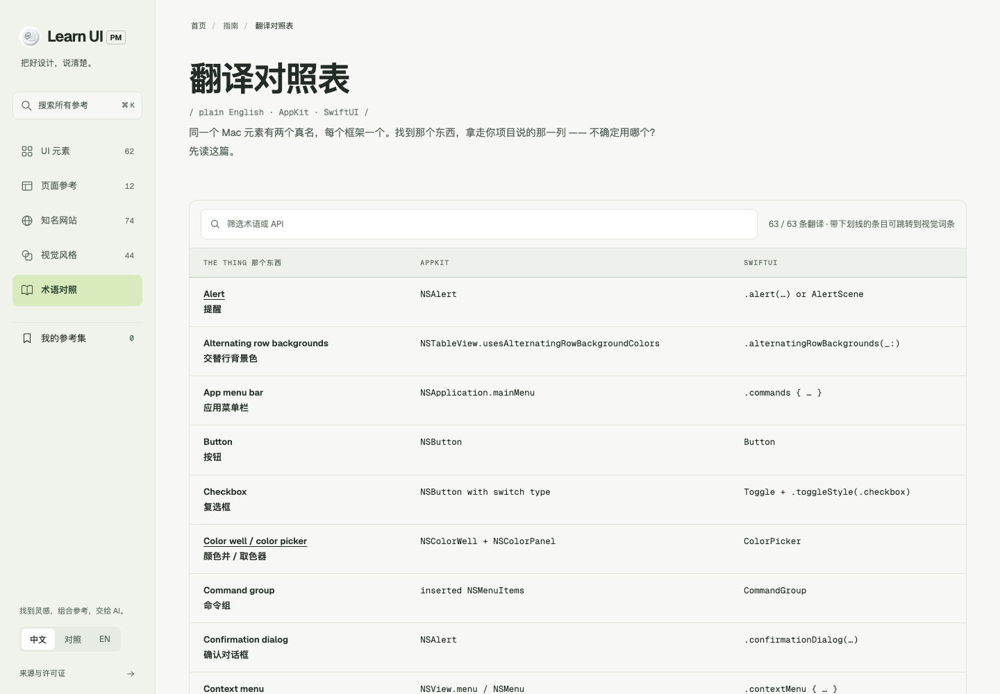

# Learn UI PM

**中文** | [English](#english)



> UI 视觉词典的中英双语对照版：看到元素，学会它的真名（Web CSS/ARIA + macOS AppKit/SwiftUI），认出风格，学会它的学名，然后精准地指挥你的 AI 编程代理。
> A bilingual (EN/中文) visual dictionary of UI: see it, name it, and prompt your coding agent with precision.

[在线演示 Live Demo](https://learnui.qiaomu.ai/) · [风格图鉴 Name That Vibe](https://learnui.qiaomu.ai/styles/) · [词条示例](https://learnui.qiaomu.ai/web/text-scramble/) · [翻译对照表](https://learnui.qiaomu.ai/guides/translate/)

**当前构建：** 240 个静态页面；62 个 UI 标本、44 个风格标本、12 个页面参考、74 个知名网站设计系统；数据校验、筛选、选择导出、状态切换和移动端布局已通过回归测试；`python3 build.py` 一条命令重建全站。

## 这是什么

[namethatui.com](https://namethatui.com/) 的**完整内容复刻 + 中英双语对照版**，为学习目的而建。原站是「UI 视觉词典」——每个词条给出一个活的界面标本、它的正式名称、一句人话解释，和一段可以直接喂给 AI 编程代理的 prompt。它的子站 **Name That Vibe**（`/styles`）是「视觉风格图鉴」——每种风格给出标本、3–8 条定义性信号（style DNA）、和一段可粘贴的风格 brief。

当前项目在保留上述上游能力的基础上，新增面向产品经理、设计师和 AI 原型开发者的**页面参考库**。使用路径是：浏览真实 HTML 示例，按产品类型、页面类型、布局、视觉气质和交互状态筛选，选择一个或多个参考，再导出结构化 Markdown 或 JSON。新增内容位于 `data/pm/` 和 `demos/pm/`，不与上游词典数据混写。

本站保留原站全部内容，并为每一段英文配上中文对照：

- **62 个词条**：31 个 Web + 31 个 macOS，每个都有可交互的活体标本（不是截图，是真 HTML/CSS/JS）
- **62 个详情页**：解剖（每个部件的名字）、Prompt、调试 Prompt、代码符号表、相关词条
- **44 种视觉风格**：Skeuomorphism、Liquid Glass、Neubrutalism、Y2K、Frutiger Aero、Aqua、Swiss Style、Bauhaus、Memphis、Vaporwave、Art Deco、Cyberpunk、Pixel Art、Corporate Memphis、Material Design、Terminal Hacker，及新增 Frutiger Metro、Anti-design、Acid Graphics、Risograph、Zine Collage、Steampunk、Dieselpunk、Biopunk、Afrofuturism、De Stijl、Constructivism、Pop Art、Surrealism、Art Nouveau、Holographic、Isometric 3D、Line Art、Hand-drawn、Fantasy RPG、LCARS…… 每种含风格标本、完整 style DNA（定义性/辅助/可变/避免信号）、易混淆风格对比、代码起点、可复制的风格 brief
- **3 篇指南**：AppKit vs SwiftUI、Swift vs Electron、翻译对照表（63 条 plain name → AppKit → SwiftUI）
- **三种阅读模式**：纯中文（默认）/ 中英对照 / 纯英文，页眉一键切换
- **全站搜索**：中英文模糊描述都能搜（试试「三个点」「mac 窗口按钮」），`/` 或 `⌘K` 聚焦、Esc 清空、匹配高亮、`?q=` 深链
- **双击查词**：双击任意英文单词，弹出通俗英文释义
- **一键复制**：Prompt、调试 Prompt、风格 brief、代码片段、整页 Markdown
- **PWA**：可安装到主屏，离线可读（service worker 缓存）
- **12 个页面参考**：覆盖后台、数据看板、AI 工具、教育产品、移动端和营销页，每个示例包含至少 3 个关键状态
- **参考选择集**：页面参考、UI 元素和视觉风格可以混合选择，导出 Markdown 或 JSON
- **AI 数据入口**：构建后优先读取 `/api/catalog.json` 和 `/api/taxonomy.json`，无需扫描整个项目
- **74 个知名网站**：按行业浏览、搜索并查看品牌 mock、中文风格解读、色板、字体和可复制 DESIGN.md

## 为什么值得用

给 AI 编程代理写 prompt 时，最大的损耗是「那个东西叫什么」。知道 *scrim*、*disclosure triangle*、*liquid glass* 这些真名，代理一次就能改对地方。双语对照让中文读者不用再猜英文术语对应什么。

## 页面巡游

| 词条详情页 | 翻译对照表 |
|---|---|
|  |  |

## 快速开始

纯静态站点，无框架、无运行时依赖，使用 Python 标准库构建：

```bash
git clone https://github.com/joeseesun/learnui.git
cd learnui
python3 scripts/sync-sites.py # 更新 74 个知名网站及线上来源镜像
python3 build.py          # 生成 site/（240 个静态页面）
python3 scripts/gen-og.py # 生成 149 张 og 分享图 → assets/og/（需 playwright）
cd site && python3 -m http.server 8000
# 打开 http://127.0.0.1:8000/
```

改上游内容：编辑 `data/*.json`（英文源数据）、`data/zh/*.json`（中文译文）、`demos/<slug>.html`（标本）。新增页面参考：编辑 `data/pm/*.json` 和 `demos/pm/<slug>.html`。构建会先运行数据校验，再生成站点。

## 项目结构

```
learnui/
├── build.py            # 静态站点生成器（Python 标准库，无依赖）
├── data/
│   ├── entries.json    # 62 词条英文源数据（复刻自 namethatui.com）
│   ├── styles.json     # 44 视觉风格英文源数据（14 条复刻自 /styles + 30 条原创）
│   ├── styles-meta.json# 风格图鉴首页文案
│   ├── zh/             # 中文译文（条目/风格/指南/翻译表）
│   ├── guides.json     # 指南页结构化内容
│   ├── translate-table.json  # 63 行 AppKit/SwiftUI 对照
│   ├── pm/             # 本项目新增的页面参考与 taxonomy
│   ├── schema/         # 新增内容的数据合同
│   ├── sites-manifest.json # 知名网站结构化清单与来源
│   └── ui.json         # 站点文案（双语）
├── demos/<slug>.html   # 62 个 UI 标本 + 44 个 style-<slug>.html 风格标本
├── demos/pm/           # 12 个页面级交互参考
├── vendor/sites/       # /sites/ 的本地主内容镜像
├── assets/             # site.css / site.js / 自托管 Geist 字体 / PWA 图标
├── manifest.webmanifest + sw.js  # PWA（构建时注入版本号）
├── DESIGN.md           # 设计系统锚点（Vercel 式黑白）
└── site/               # 构建产物，含 api/catalog.json（git 忽略）
```

## 设计

「冷静的玻璃拟态」：单张本地产品截图只在页面边缘提供低饱和蓝绿折射，中央内容区保持中性冷灰；导航、筛选、控制条和选择抽屉使用半透明表面、内高光与细边框。Geist/Geist Mono 字体自托管，标本保留被模仿系统的外观，不被站点主题覆盖。完整设计约束见 [DESIGN.md](DESIGN.md)。

## 实测验证

- 页面参考回归：多维筛选、三类选择持久化、状态切换、Markdown/JSON 导出入口通过
- 桌面与 390px 移动端 Playwright 检查无 JavaScript 错误、无横向溢出
- 原有搜索、平台筛选、语言切换、随机词条和复制能力保留
- 线上环境：<https://learnui.qiaomu.ai/> 200，HTTPS + HSTS，Umami 统计链路实测写入成功

## 限制与版权

- 英文源内容（`data/entries.json`、`data/guides.json`、`data/styles.json`）复刻自 [namethatui.com](https://namethatui.com/)，版权归原作者；本仓库代码（构建器、标本重实现、样式、译文）以 [MIT](LICENSE) 开源。
- 标本为学习目的的重新实现，不保证与原站像素级一致；原站如有更新，本站不会自动同步。
- 双击查词依赖 `dictionaryapi.dev` 的免费接口，网络不可用时优雅降级。

## 关于向阳乔木

- 网站：[qiaomu.ai](https://qiaomu.ai/) · 博客：[blog.qiaomu.ai](https://blog.qiaomu.ai/) · 工具推荐：[tuijian.qiaomu.ai](https://tuijian.qiaomu.ai/)
- X：[@vista8](https://x.com/vista8) · GitHub：[@joeseesun](https://github.com/joeseesun)
- 微信公众号：向阳乔木推荐看

---

<a name="english"></a>

# Learn UI PM - Bilingual (EN/中文) Visual Dictionary of UI

A faithful content replica of [namethatui.com](https://namethatui.com/) (including the **Name That Vibe** styles atlas) with full Chinese-English parallel text, built for learning. See a UI element or a visual style, learn its real name, and prompt your coding agent with precision.

**Live demo:** <https://learnui.qiaomu.ai/>

- **62 entries** (31 Web + 31 macOS), each with a **live interactive specimen** (real HTML/CSS/JS, not screenshots)
- **44 visual styles** (Skeuomorphism, Liquid Glass, Neobrutalism, Y2K, Frutiger Aero, Aqua, Swiss Style, Bauhaus, Memphis, Vaporwave, Art Deco, Cyberpunk, Pixel Art, Corporate Memphis, Material Design, Terminal Hacker, plus 20 more: Frutiger Metro, Anti-design, Acid Graphics, Risograph, Zine Collage, Steampunk, Dieselpunk, Biopunk, Afrofuturism, De Stijl, Constructivism, Pop Art, Surrealism, Art Nouveau, Holographic, Isometric 3D, Line Art, Hand-drawn, Fantasy RPG, LCARS): style specimen, full style DNA signals, look-alike comparison, code starting points, copy-ready style brief
- **62 detail pages**: anatomy of every part, copy-ready agent prompt, debug prompt, API symbol table, related entries
- **3 guides**: AppKit vs SwiftUI, Swift vs Electron, and a 63-row Translation Table
- **3 reading modes**: 中文 (default) / bilingual / English, persisted in localStorage
- **Full-text search** in English and Chinese (`/` or `⌘K` to focus, match highlighting, `?q=` deep links), **double-click any word** for a plain-English definition, **copy page as Markdown**
- **PWA**: installable, offline-readable

## Quick start

```bash
git clone https://github.com/joeseesun/learnui.git
cd learnui
python3 build.py          # builds site/ (240 static pages, stdlib only)
python3 scripts/gen-og.py # 1200x630 og images for every page (needs playwright)
cd site && python3 -m http.server 8000
```

Edit `data/*.json` (English source), `data/zh/*.json` (Chinese), or `demos/<slug>.html` (specimens), then rebuild.

## Verified

- Page-reference filters, mixed selection, state switching, and desktop/mobile layouts pass targeted Playwright regression checks
- Interaction tests pass: EN/ZH search, platform filter, language modes, random entry, clipboard, table filter, lightbox
- No horizontal overflow at 390px; production site live with HTTPS + HSTS + Umami

## License & attribution

Code (builder, specimen reimplementations, styles, translations) is [MIT](LICENSE). English source content in `data/` is replicated from [namethatui.com](https://namethatui.com/) for learning purposes and remains © its original author.

Maintained by 向阳乔木 · [qiaomu.ai](https://qiaomu.ai/) · X [@vista8](https://x.com/vista8) · GitHub [@joeseesun](https://github.com/joeseesun)
